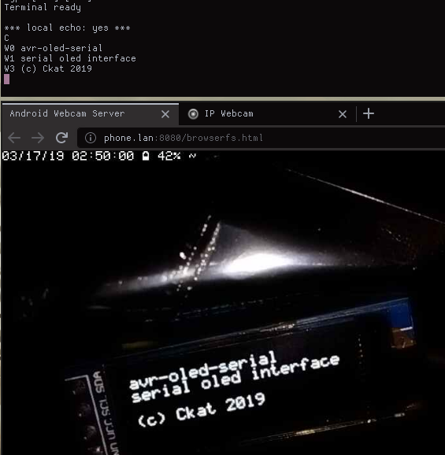

---
simple avr program exposing some oled library functions over a serial connection, uses a patched version of [oled-display:fa446f6](https://github.com/Sylaina/oled-display/tree/fa446f61112e36c5753a6f81c5caf5b819155650) for controlling the display. currently only tested on an ssd1306 (128x32 and 128x64) display with arduino uno, but it should be straight forward to make it work on other devices.

## usage
open a serial connection baudrate `115200`,\
use the commandset:

cmd      | action
---      | ---
Wn str   | write *str* to row *n*
Px,y str | write *str* to position *x*,*y*
I        | invert screen
C        | clear screen

## todo
- add more commands
- strip down/extend oled library more
